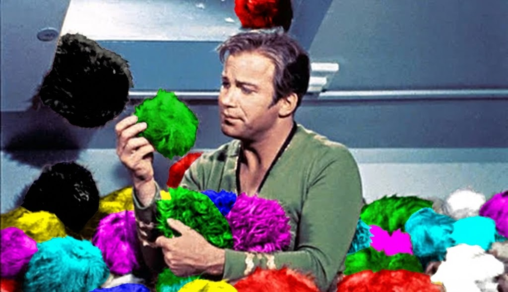

# Tribble

A Claude Code plugin that spawns Claude code sessions in new terminal tabs.

```
You: "Spawn claude sessions for auth, payments, and docs"

✓ Created 'Auth'
✓ Created 'Payments'
✓ Created 'Docs'
```

Three Claude sessions running in parallel with proper context. Like tribbles multiplying.

## Install

```bash
curl -fsSL https://raw.githubusercontent.com/fractional-ai/tribble/main/install.sh | bash
```

Restart Claude Code after installing. To skip approval prompts, add `Bash(~/.claude/plugins/tribble/scripts/*)` to your allowed permissions in `~/.claude/settings.json`.

## Usage

Tell Claude what you want to spawn using natural language:

```
"Spawn a claude session for the auth refactor"
"Start three tabs: frontend, backend, and test watcher"
"Open claude to work on tests"
```

Or use the slash command directly:

```
/tribble:spawn open claude to refactor the auth module
/tribble:spawn npm run dev, npm test --watch
```

When spawning Claude sessions, the new session receives context about what you're working on.

## Supported Terminals

| Platform | Terminals |
|----------|-----------|
| **macOS** | iTerm2, Terminal.app, Ghostty, Kitty, Alacritty, tmux |
| **Linux** | GNOME Terminal, Kitty, Alacritty, tmux |
| **Windows (WSL)** | Windows Terminal, Kitty, Alacritty, tmux |

**Kitty** requires remote control enabled in `~/.config/kitty/kitty.conf`:
```
allow_remote_control yes
```

For unsupported terminals (VS Code integrated terminal, etc.), run inside tmux:

```bash
tmux new-session -s work
```

## Troubleshooting

| Problem | Fix |
|---------|-----|
| "Not authorized to send Apple events" | System Preferences → Security → Automation → Enable |
| Tabs don't spawn | `find ~/.claude/plugins/tribble/scripts -name "*.sh" -exec chmod +x {} \;` |
| "Not in a tmux session" | Start tmux first: `tmux new-session -s work` |

Run `./scripts/validate-installation.sh` to diagnose issues.

## Manual Install

```bash
git clone https://github.com/fractional-ai/tribble.git ~/.claude/plugins/tribble
find ~/.claude/plugins/tribble/scripts -name "*.sh" -exec chmod +x {} \;
```

## Update

```bash
cd ~/.claude/plugins/tribble && git pull
```

## Issues

Report bugs: https://github.com/fractional-ai/tribble/issues

---

*"Obviously tribbles are very perceptive creatures, Captain."*
— Spock (Star Trek)


